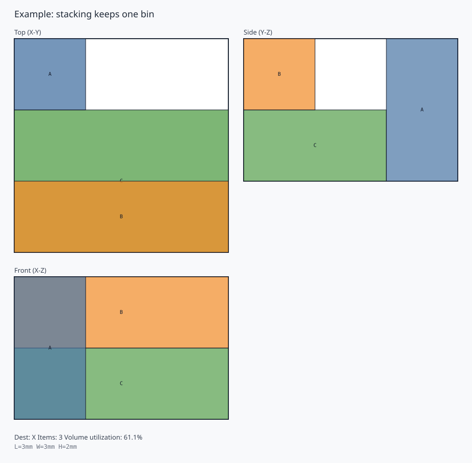
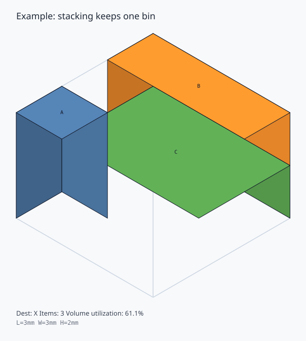

# Step2 3D配置の見方

Step2 では、重量制約や重心制約はまだ入れずに、まず「箱を3Dで置ける」実行可能解を作ります。

実装しているルールは次のとおりです。

1. 行先ごとに箱を分け、体積の大きい順に処理する
2. 既に置いた箱の `+x / +y / +z` 面から候補座標を作る
3. 各候補座標で、回転なし / 90度回転を試す
4. `コンテナ内`、`非重複`、`床置きまたは完全支持` を満たす配置だけ残す
5. `y -> x -> z` を優先するスコアで、その bin の最良配置を選ぶ
6. 既存の bin に入らなければ、新しい bin を作る

## 例題

「積み上げれば 1 bin に収まる」ことを見せる最小例です。

- コンテナ: `L=3, W=3, H=2`
- 箱A: `1x1x2`
- 箱B: `3x1x1`
- 箱C: `3x2x1`

期待する見え方は、床面を C が埋め、その上に B が積まれ、縦長の A が残りの床面に入る形です。



さらに、斜め上から見た立体図も用意できます。



### 配置結果

| bin | item | dest | x | y | z | l | w | h | rotated |
| --- | --- | --- | ---: | ---: | ---: | ---: | ---: | ---: | --- |
| 1 | C | X | 0 | 0 | 0 | 3 | 2 | 1 | no |
| 1 | A | X | 0 | 2 | 0 | 1 | 1 | 2 | no |
| 1 | B | X | 0 | 0 | 1 | 3 | 1 | 1 | no |

## 三面図の見方

- Top: 床面の詰まり方
- Front: 長さ方向に見た積み上がり
- Side: 幅方向に見た積み上がり

## 立体図の見方

- 上下関係を一目で把握しやすい
- 手前と奥の箱の位置関係を説明しやすい
- 三面図より直感的だが、厳密な寸法確認は三面図の方が向く

## 本番データの説明資料

本番データ 80 箱に対する三面図と説明レポートは、次のコマンドで再生成できます。

```powershell
python scripts\generate_step2_3d_explanation.py
```

生成先:

- `artifacts/step2_3d_explanation/README.md`
- `artifacts/step2_3d_explanation/realdata/*.svg`
- `artifacts/step2_3d_explanation/example/stacking_single_bin_example_isometric.svg`
