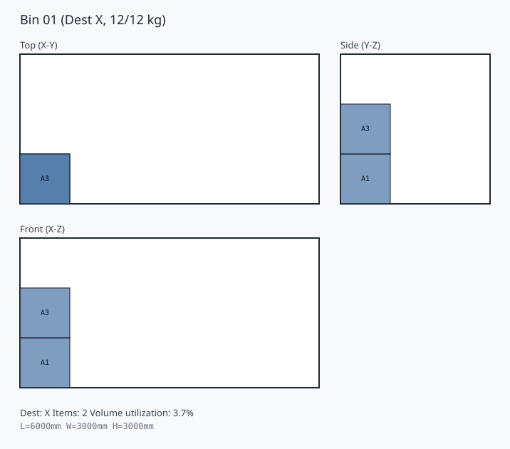
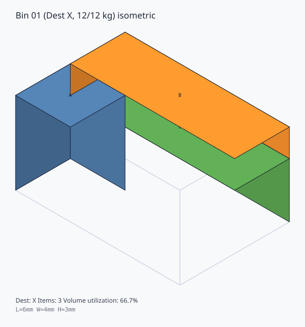
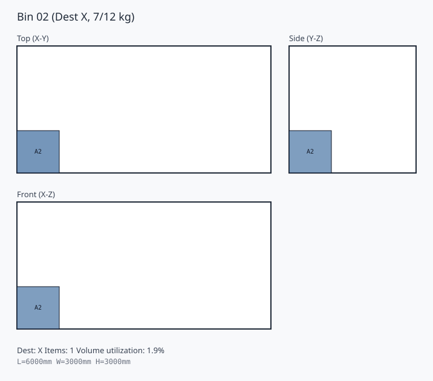
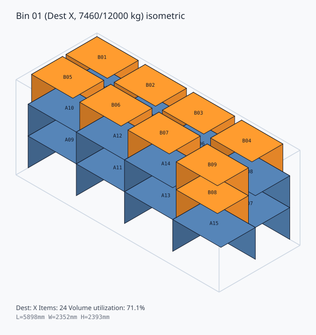

# Step3 重量制約つき 3D 配置の見方

Step3 では、Step2 の 3D 配置に対して、重量上限と積み上げ安定性の確認を追加します。

実装しているルールは次のとおりです。

1. 行先ごとに箱を分け、重い順に重量 bin へ割り当てる
2. 各重量 bin に対して Step2 の 3D 配置を行う
3. 各 bin の総重量が `max_weight_kg` を超えないことを確認する
4. 配置後に、各箱の重心の鉛直投影が床または支持面に入ることを確認する

## 例題

`approach.md` の **小3-2** に合わせて、**小2-1 と同じ箱セット**を使います。

- コンテナ: `L=6, W=4, H=3`
- 重量上限: `12kg`
- X向け 3箱: `XA=2x2x3 (5kg)`, `XB=6x2x1 (4kg)`, `XC=6x2x2 (3kg)`
- Y向け 3箱: `YA=2x2x3 (6kg)`, `YB=6x2x1 (4kg)`, `YC=6x2x2 (2kg)`

この例では、X と Y を混載せず、それぞれ 1 bin ずつに積み上げます。

### bin 1: 行先 X





### bin 2: 行先 Y





## 説明レポートの生成

説明用レポートと本番データの SVG は次で再生成できます。

```powershell
python scripts\generate_step3_weighted_3d_explanation.py
```

出力先:

- `artifacts/step3_weighted_3d_explanation/README.md`
- `artifacts/step3_weighted_3d_explanation/example/*.svg`
- `artifacts/step3_weighted_3d_explanation/realdata/*.svg`

## 読み方

- 3 面図では、箱の位置と積み上げ方を確認します
- 立体図では、前後関係と高さ方向の重なりを確認します
- タイトルの `kg` 表示で、その bin の重量使用量を確認します
