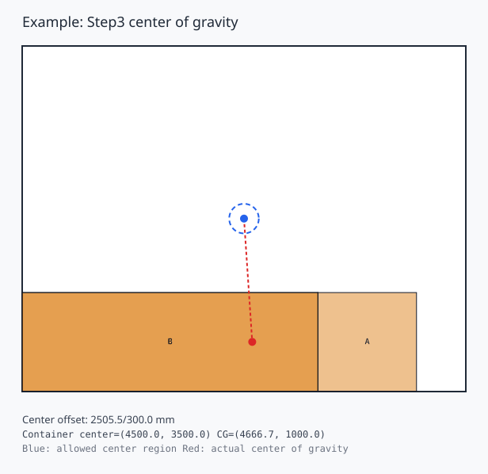
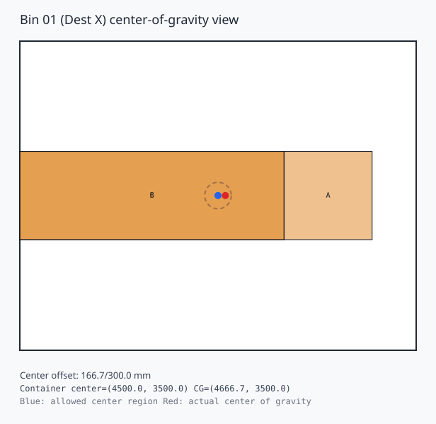
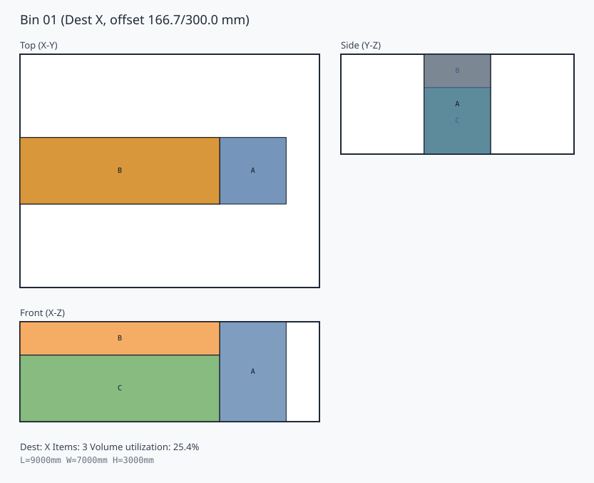
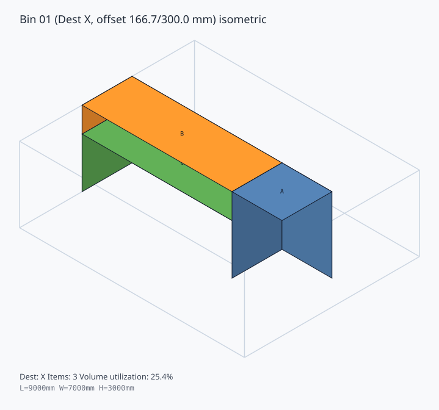

# Step4 重心制約つき 3D 配置の見方

Step4 では、Step3 の配置結果に対して、各コンテナの水平重心が床面中心から半径 `300mm` 以内に収まるように調整します。

## 出力先の整理

- `artifacts/step4_center_of_gravity_explanation/...`: 説明スクリプト `python scripts\generate_step4_center_of_gravity_explanation.py` の本体出力
- `artifacts/test_step4_center_balance_...`: テスト実行時だけに使う確認用出力
- `docs/...svg`: ガイドから直接参照するために置いている固定の説明用画像

本番データの全 bin を見たいときは、`artifacts/step4_center_of_gravity_explanation/realdata/` を見ます。

## 例題

Step4 の例題では、Step3 の結果が左前に寄っている状態から、bin 全体を平行移動して床面中心へ寄せます。

### Step3 の重心位置



### Step4 の重心位置



### Step4 の配置図





## 説明レポートの生成

```powershell
python scripts\generate_step4_center_of_gravity_explanation.py
```

出力先:

- `artifacts/step4_center_of_gravity_explanation/README.md`
- `artifacts/step4_center_of_gravity_explanation/example/*.svg`
- `artifacts/step4_center_of_gravity_explanation/realdata/*.svg`
